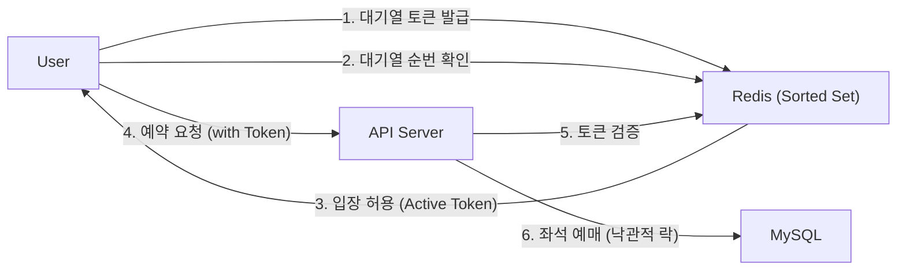

# 대용량 트래픽 처리를 위한 콘서트 대기열 예약 서비스

http://3.35.212.206:8080/swagger-ui/index.html

> **"수십만 명이 동시에 접속하는 연예인 콘서트 티켓팅, 어떻게 서버를 터트리지 않고 순서대로 입장시킬까?"** 라는 고민에서 시작한 프로젝트입니다.<br>
>  Redis 기반의 대기열 시스템과 낙관적 락을 활용한 동시성 제어를 통해 데이터 정합성과 시스템 안정성을 확보했습니다.
<br>


## Tech Stack

| Category | Technology |
| :--- | :--- |
| **Language** | Java 17 |
| **Framework** | Spring Boot, Spring Security |
| **Database** | MySQL 8.0, Redis |
| **Infrastructure** | AWS EC2, Docker Compose, GitHub Actions |
| **Monitoring** | Prometheus, Grafana |
| **ORM** | Spring Data JPA, QueryDSL |
| **Test** | JUnit5, Mockito, k6 |
| **Tools** | Swagger, Gradle, IntelliJ |

<br>

## System Architecture



```
## Key Troubleshooting & Performance (핵심 성과)
1. 동시성 제어: 좌석 중복 예약 방지
문제 상황: 인기 좌석 1석에 대해 1,000명의 유저가 동시에 예약을 시도할 때, Race Condition으로 인해 초과 예약이 발생할 수 있음.

해결 과정:
synchronized나 비관적 락(Pessimistic Lock)은 DB 점유 시간이 길어 성능 저하 우려.
충돌 빈도가 높지만 빠른 처리가 중요한 티켓팅 특성상 낙관적 락(Optimistic Lock) 채택.
JPA의 @Version을 사용하여 애플리케이션 레벨에서 버전을 체크.

검증 결과 (JUnit):
ExecutorService를 활용한 1,000명 동시 요청 테스트 수행.
성공 1건, 실패 999건 (정확한 락 동작 확인).

2. 대기열 시스템 성능 검증 (부하 테스트)
목표: 대규모 트래픽 발생 시 Redis 기반 대기열 시스템의 가용성 및 처리량 한계 검증
테스트 환경: k6 (VUser 1000명, Ramp-up/down 시나리오 적용), Prometheus, Grafana
결과:
TPS (Throughput): 1862/s 달성
안정성: 요청 성공률 100% (Error 0%)
Latency: p95 기준 약 434ms (로컬 환경 자원 경합으로 인한 CPU 병목 확인, 에러 없이 전량 처리됨을 확인하여 아키텍처의 안정성을 입증)
``` 
[참고 이미지]


```
3. Redis Pipelining을 통한 대기열 성능 최적화
문제 상황: 스케줄러가 1000명의 유저를 입장시킬 때 `for`문을 돌며 `SET` 명령어를 1000번 호출하여 Redis와의 잦은 네트워크 통신(RTT)이 병목이 될 것을 우려함

해결 과정:
- Redis Pipelining 도입: 명령어를 패킷 단위로 묶어 전송하여 RTT를 획기적으로 단축
- Batch Processing: 대량 처리 시 안정성을 위해 1000건 단위의 Chunk 분할 처리 로직 적용

검증 : 전체 부하 테스트와 별개로 스케줄러 로직의 효율성만을 검증하기 위한 별도 격리 테스트 수행
    - 결과: Loop(7.4초) vs Pipeline(0.9초)
    - 성과: 약 7배의 성능 향상을 데이터로 확인

결과: 네트워크 통신 횟수 1000회 → 1회 단축, 동일 환경 대비 처리 속도 약 760% 향상 (7.4s → 0.9s)
```
[참고 이미지]


```
4. GitHub Actions & AWS 기반의 자동 배포 파이프라인(CI/CD) 구축
문제 상황: 로컬에서 빌드 후 수동으로 서버에 파일을 옮기는 비효율적 배포 과정

해결 과정: GitHub Actions를 활용하여 main 브랜치 푸시 시 Docker 이미지 빌드 → Docker Hub 푸시 → AWS EC2 배포 전 과정 자동화
  - .env와 같은 민감 정보는 GitHub Secrets를 통해 관리하고 배포 시점에 동적으로 주입하여 보안성 강화

결과: 네트워크 통신 횟수 1000회 → 1회 단축, 대량 트래픽 처리 속도 개선
```
[API Documentation]
Swagger UI: http://3.35.212.206:8080/swagger-ui/index.html


```
[How to Run]
- Prerequisites
Docker & Docker Compose
Java 17+

- Steps
1. Clone the repository
  git clone https://github.com/your-username/ticket-service.git
2. Create .env file
3. Run with Docker Compose (App + DB + Redis)
```
